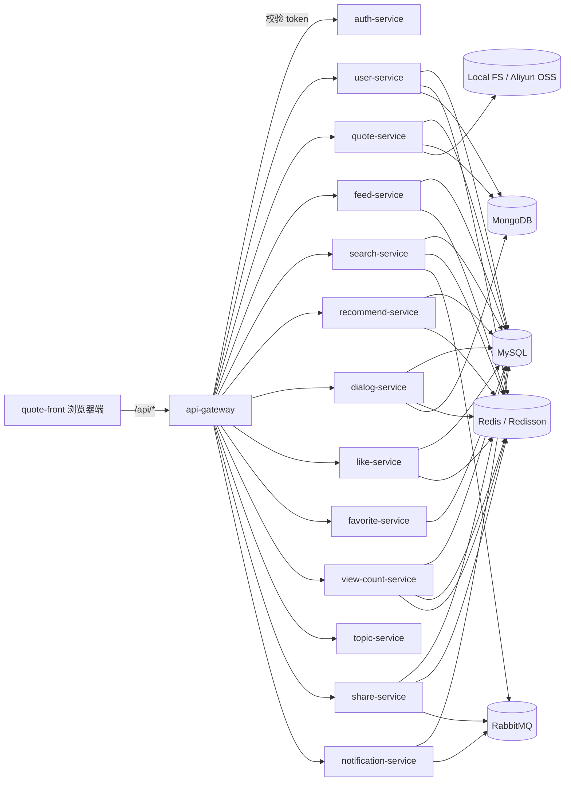
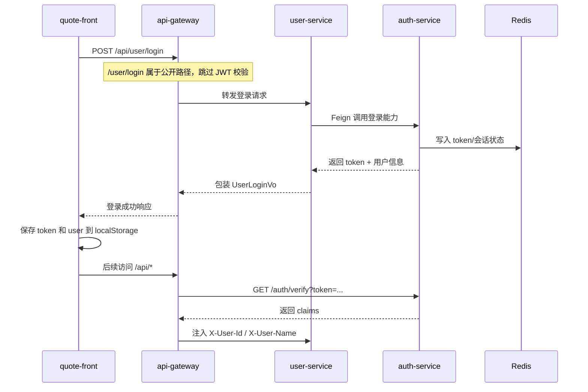
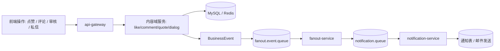

# QingShu 项目全量说明与智能体记忆文档

## 文档信息
- 覆盖仓库：`QingShu` 后端仓库 + 同级 `quote-front` 前端仓库。
- 仓库关系：当前工作区由两个独立 Git 仓库组成，`QingShu` 负责后端，`quote-front` 负责前端；工作区根目录 `QingShu-All` 本身不是 Git 仓库。
- 文档落点：主文档保存在 `QingShu/docs`，但内容显式覆盖前端仓库。
- 排除范围：`interview-agent` 未接入 `QingShu/pom.xml` 聚合构建，不属于本次正式业务说明；`.idea`、`.lingma` 属于 IDE/工具元数据；`files/` 更偏运行时文件目录。
- 目标读者：后续智能体、开发者、接手维护人员。
- 信息来源：以当前仓库中的 `pom.xml`、`package.json`、`bootstrap.yml`、`application.yml`、Controller、现有 README/docs、前端路由和 API 文件为准，不依赖外部口径。
- 覆盖基线：
  - `QingShu/pom.xml` 聚合的 20 个模块全部纳入本文。
  - 已识别 39 个后端 Controller，均在对应服务章节下归类。
  - `quote-front/src/api` 中 8 个 API 文件全部映射到后端服务。
  - `quote-front` 当前可见规模为 54 个 `pages`、2 个 `views`、50 个 `components` 文件。

## 目录
1. 项目定位与仓库边界
2. 总体架构与运行模式
3. 后端服务全量说明
4. 前端能力与页面映射
5. 技术栈矩阵
6. 核心数据流与消息流
7. 部署、配置与依赖说明
8. 智能体快速上手与高价值入口

---

## 1. 项目定位与仓库边界

### 1.1 系统定位
QingShu 是一个围绕引文/诗词/内容卡片构建的内容社区系统，功能已不止于单纯的内容管理，而是演化为一套带有社交、分发、推荐、搜索、审核、举报、分享、通知、聊天与 AI 助手能力的前后端分离平台。

从业务面看，项目至少包含以下主能力：
- 用户注册、登录、资料编辑、邮箱与密码管理。
- 引文内容发布、编辑、草稿、上下架、审核、详情展示、搜索建议。
- 点赞、评论、收藏、浏览计数、分享访问、话题绑定。
- 关注关系、黑名单、隐私设置、动态流、未读数管理。
- 搜索、推荐、热榜、创作者中心与内容数据分析。
- 站内通知、举报受理、AI 对话、普通私聊与管理员接管。

### 1.2 工作区边界

| 路径 | 角色 | 是否正式业务范围 | 说明 |
| --- | --- | --- | --- |
| `QingShu/` | 后端主仓库 | 是 | Maven 聚合工程，包含 20 个模块。 |
| `quote-front/` | 前端主仓库 | 是 | Vue 3 + Vite 单页应用。 |
| `QingShu/interview-agent/` | 旁路目录 | 否 | 当前未纳入 `QingShu/pom.xml` 模块聚合。 |
| `QingShu/files/` | 运行时资源目录 | 部分相关 | 更偏本地上传文件承载，不是业务源码模块。 |
| `QingShu/.idea`、`QingShu/.lingma` | 工具目录 | 否 | IDE/辅助工具元数据。 |

### 1.3 后端模块总览

| 模块 | 角色定位 | 备注 |
| --- | --- | --- |
| `mall-common` | 共享基础库 | 自动配置、公共事件、工具、统一响应、限流、上下文。 |
| `api-gateway` | 微服务网关 | JWT 校验、限流、Sentinel、防护入口。 |
| `auth-service` | 认证服务 | Token 签发与校验。 |
| `user-service` | 用户与关系域 | 用户资料、关系、隐私、举报。 |
| `quote-service` | 内容主服务 | 引文 CRUD、审核、标签、分类、数据分析。 |
| `oss-service` | 文件存储服务 | 本地/阿里云 OSS 存储。 |
| `notification-service` | 通知服务 | 站内通知与邮件发送。 |
| `like-service` | 点赞与热榜服务 | 点赞状态、点赞统计、热榜快照。 |
| `favorite-service` | 收藏服务 | 收藏夹与收藏项管理。 |
| `ai-service` | AI 能力封装 | 赏析与回复生成。 |
| `comment-service` | 评论服务 | 评论与评论点赞。 |
| `view-count-service` | 浏览计数服务 | 去重计数、纠偏、批量统计。 |
| `share-service` | 分享服务 | 分享链接、访问校验、访问记录。 |
| `dialog-service` | 聊天/AI 对话服务 | 会话、消息、知识库、WebSocket、管理员接管。 |
| `fanout-service` | 事件分发服务 | MQ 事件接收、去重、规则分发、补偿。 |
| `feed-service` | 动态流服务 | 关注流、过滤、未读数、聚合。 |
| `search-service` | 搜索服务 | 建议词、结果页、搜索历史、索引同步。 |
| `topic-service` | 话题服务 | 话题、话题分类、内容绑定、关注。 |
| `doubao-starter` | 单体聚合启动器 | 将各服务 server 模块组合为单体运行。 |
| `recommend-service` | 推荐服务 | Feed、相关内容、行为采集、画像与预计算。 |

### 1.4 模块组织模式
- 大多数业务服务采用三段式结构：`*-api`、`*-server`、`*-starter`。
- 例外：
  - `mall-common`、`api-gateway`、`doubao-starter` 是单模块。
  - `recommend-service` 当前只有 `recommend-service-server` 与 `recommend-service-starter`，没有单独的 `-api` 模块。
- 对后续智能体而言，读代码时通常遵循：
  - DTO / Entity / Feign / Service 接口看 `*-api`
  - Controller / Mapper / 业务实现 / MQ / 定时任务看 `*-server`
  - 启动方式与 Nacos 配置接入看 `*-starter`

---

## 2. 总体架构与运行模式

### 2.1 总体架构
项目的常见请求链路为：
- 浏览器访问 `quote-front`。
- 前端统一经 `/api` 前缀调用后端。
- 微服务模式下首先进入 `api-gateway`，由网关做 JWT 校验、限流、服务转发。
- 网关向下游服务注入 `X-User-Id`、`X-User-Name` 等头部，业务服务通过 `UserContext` 读取。
- 各业务服务通过 MySQL、Redis、MongoDB、RabbitMQ、OSS 和 WebSocket 完成主流程。

### 2.2 关键版本
- Java：1.8
- Spring Boot：2.6.2
- Spring Cloud：2021.0.2
- Spring Cloud Alibaba：2021.0.5.0

### 2.3 服务治理与基础设施
- 服务注册与配置中心：Nacos
- 网关：Spring Cloud Gateway
- 服务调用：OpenFeign
- 熔断/隔离：Resilience4j
- 网关流控：Sentinel
- 数据库访问：MyBatis-Plus + MySQL
- 缓存与分布式锁：Redis + Redisson
- 文档/去重/证据等非关系数据：MongoDB
- 异步消息：RabbitMQ / Spring AMQP / 部分 Spring Cloud Stream Rabbit 依赖
- 实时通信：Spring WebSocket
- 文件存储：本地文件系统 + 阿里云 OSS 双策略

### 2.4 双运行模式

#### 微服务模式
- 各 `*-starter` 模块都配置了 `@EnableDiscoveryClient`。
- 多个服务还启用了：
  - `@EnableFeignClients`
  - `@EnableScheduling`
  - Mongo 仓库扫描或特定配置
- 各服务的 `bootstrap.yml` 均以 Nacos 为中心，通常拉取共享配置：
  - Redis
  - MongoDB
  - RabbitMQ
- 这种模式下，路由、注册中心和动态配置大概率以 Nacos 为准，本地仓库只保留接入方式与默认值。

#### 单体模式
- `doubao-starter` 会直接引入多个 `*-server` 模块，作为一个单体应用启动。
- `DoubaoStarterApplication` 在启动时显式设置 `service.run-mode=monolith`。
- `doubao-starter/src/main/resources/application.yml` 中关闭了注册中心与配置中心开关，并集中配置数据库、缓存、MQ、邮件、OSS、分享等外部依赖。
- `mall-common` 中提供了 `@MicroserviceMode` 和 `@MonolithMode` 条件注解，用于在不同运行模式下装配不同 Bean。

### 2.5 公共认证与入口规则
- `api-gateway` 中的 `JwtAuthenticationFilter` 会跳过以下公开路径前缀：
  - `/auth/`
  - `/user/login`
  - `/user/register`
  - `/user/verify`
  - `/user/forgot-password`
  - `/public/`
  - `/dialog/ws`
  - `/actuator/health`
- 其余请求必须带 `Authorization: Bearer <token>`。
- 网关会调用 `auth-service` 的 `/auth/verify` 验证 token，然后把用户信息注入下游请求头。

---

## 3. 后端服务全量说明

### 3.1 基础与网关

#### `mall-common`
- 服务职责与边界：
  - 提供公共实体、统一返回体、异常、事件模型、工具类、线程池、用户上下文、分布式限流与基础自动配置。
- 控制器/接口清单：
  - 无公共 Controller。
- 上下游依赖与通信方式：
  - 通过 `META-INF/spring.factories` 向各服务暴露自动配置。
  - 被几乎所有业务模块作为共享依赖引用。
- 关键规则、缓存、定时任务或异步机制：
  - 自动装配 `UserContextAutoConfiguration`、`ThreadPoolAutoConfiguration`、`RedisConfig`、`RedissonConfig`、`RabbitMQConfig`、`RateLimitAutoConfiguration`。
  - 提供 `BusinessEvent`、`LikeEvent`、`CommentEvent`、`DialogEvent`、`NotificationEvent`、`VerifyQuoteEvent`、`AuditQuoteEvent` 等事件模型。
  - 提供 `RateLimit` 注解与 AOP，适合服务内限流。
- 智能体优先阅读的入口文件：
  - `mall-common/src/main/resources/META-INF/spring.factories`
  - `mall-common/src/main/java/org/doubao/mall/common/handler/UserContextFilter.java`
  - `mall-common/src/main/java/org/doubao/mall/common/ratelimit/aop/RateLimitAspect.java`

#### `api-gateway`
- 服务职责与边界：
  - 作为微服务模式统一入口，负责鉴权、限流、Sentinel 防护与网关级回退。
- 控制器/接口清单：
  - `FallbackController`
    - `/fallback/products/circuit`
- 上下游依赖与通信方式：
  - 通过 `WebClient` 调用 `auth-service` 的 `/auth/verify` 校验 token。
  - 使用 Redis 限流器。
- 关键规则、缓存、定时任务或异步机制：
  - `JwtAuthenticationFilter` 负责公开路径放行、JWT 校验、请求头透传。
  - `CustomRateLimiterGatewayFilterFactory` 负责 Redis 限流并返回统一 429 JSON。
  - `SentinelGatewayConfig`、`SentinelFilterConfig`、`GlobalSentinelExceptionHandler` 负责网关流控与异常适配。
- 智能体优先阅读的入口文件：
  - `api-gateway/src/main/java/org/doubao/api/gateway/filter/JwtAuthenticationFilter.java`
  - `api-gateway/src/main/java/org/doubao/api/gateway/handler/CustomRateLimiterGatewayFilterFactory.java`
  - `api-gateway/src/main/resources/bootstrap.yml`

#### `auth-service`
- 服务职责与边界：
  - 提供 token 签发、token 校验、WebSocket token 能力与 token 过期处理。
- 控制器/接口清单：
  - `AuthController`
    - `/auth/login`
    - `/auth/verify`
    - `/auth/token/webSocket`
    - `/auth/token/expiration`
- 上下游依赖与通信方式：
  - 被 `api-gateway` 用于 JWT 校验。
  - 被 `user-service` 通过 Feign 调用登录接口。
- 关键规则、缓存、定时任务或异步机制：
  - 同时存在 `JwtAuthenticationFilter` 与 `JwtAuthenticationFilterLocal`，对应不同运行模式或接入方式。
  - 使用 Redis 保存 token 相关状态。
  - 依赖 `jjwt`。
- 智能体优先阅读的入口文件：
  - `auth-service/auth-service-server/src/main/java/org/doubao/auth/service/controller/AuthController.java`
  - `auth-service/auth-service-server/src/main/java/org/doubao/auth/service/utils/JwtUtil.java`
  - `auth-service/auth-service-server/src/main/java/org/doubao/auth/service/filter/JwtAuthenticationFilterLocal.java`

#### `oss-service`
- 服务职责与边界：
  - 文件上传、文件地址获取、公开文件读取；支持本地存储与阿里云 OSS 双模式。
- 控制器/接口清单：
  - `OssController`
    - `/oss/upload`
    - `/oss/url`
  - `FilePublicController`
    - `/public/oss/files`
- 上下游依赖与通信方式：
  - 被 `user-service`、`topic-service` 等通过 Feign 引用。
  - 文件落本地或阿里云 OSS。
- 关键规则、缓存、定时任务或异步机制：
  - 现有 README 明确支持本地和阿里云 OSS。
  - 路径加密、文件类型校验是该服务的核心边界之一。
  - 单体配置中可见本地文件基目录与公开下载基地址，但对外输出文档时应仅保留抽象说明。
- 智能体优先阅读的入口文件：
  - `oss-service/README.md`
  - `oss-service/oss-service-server/src/main/java/org/doubao/oss/service/controller/OssController.java`
  - `oss-service/oss-service-starter/src/main/resources/bootstrap.yml`

#### `notification-service`
- 服务职责与边界：
  - 处理站内通知查询、未读统计、批量已读、消息格式化，以及注册邮件发送。
- 控制器/接口清单：
  - `NotificationController`
    - `/notifications/user`
    - `/notifications/latest`
    - `/notifications/{id}/read`
    - `/notifications/batch-read`
    - `/notifications/{id}`
    - `/notifications/unread-count/{userId}`
    - `/notifications/unread-count-type`
    - `/notifications/detail/{id}`
- 上下游依赖与通信方式：
  - 消费 `notification.queue` 中的业务事件。
  - 使用邮件服务器发送注册相关邮件。
- 关键规则、缓存、定时任务或异步机制：
  - `NotificationListener` 支持 `USER_REGISTER`、`COMMENT_EVENT`、`LIKE_EVENT`、`QUOTE_EVENT`、`NEW_MESSAGE`。
  - 使用 `NotificationFormatter` 将系统、点赞、评论、聊天事件转成通知实体。
  - 站内通知数据存入 MySQL，邮件走 `JavaMailSender`。
- 智能体优先阅读的入口文件：
  - `notification-service/notification-service-server/src/main/java/org/doubao/notification/service/controller/NotificationController.java`
  - `notification-service/notification-service-server/src/main/java/org/doubao/notification/service/listener/NotificationListener.java`
  - `notification-service/notification-service-server/src/main/java/org/doubao/notification/service/utils/NotificationFormatter.java`

#### `fanout-service`
- 服务职责与边界：
  - 接收统一业务事件，按规则分发到不同 exchange/queue，并提供失败记录重试能力。
- 控制器/接口清单：
  - `FanoutController`
    - `/fanout/retry/{recordId}`
    - `/fanout/retry/batch`
    - `/fanout/fail-records`
    - `/fanout/rules/reload`
- 上下游依赖与通信方式：
  - 消费 `fanout.event.queue`。
  - 下游可能投递到通知、统计、动态流等多个队列。
- 关键规则、缓存、定时任务或异步机制：
  - `EventReceiver` 使用 Redis 做事件去重。
  - `EventHandler` / `FanoutDispatcher` / `MessageAssembler` 负责路由和消息构造。
  - 单体配置中的 `fanout.rules` 展示了按 `message-type` 配置投递目标的能力。
  - `FailMessageService` 保留失败补偿逻辑。
- 智能体优先阅读的入口文件：
  - `fanout-service/fanout-service-server/src/main/java/org/doubao/fanout/service/component/EventReceiver.java`
  - `fanout-service/fanout-service-server/src/main/java/org/doubao/fanout/service/controller/FanoutController.java`
  - `doubao-starter/src/main/resources/application.yml` 中的 `fanout.*` 配置

#### `doubao-starter`
- 服务职责与边界：
  - 单体聚合启动器；在不依赖 Nacos 注册/配置中心的前提下把多个业务服务组装进一个应用。
- 控制器/接口清单：
  - 无独立业务 Controller；实际暴露的是被聚合进来的各服务 Controller。
- 上下游依赖与通信方式：
  - 直接依赖多个 `*-server` 模块，而不是通过网络注册发现。
- 关键规则、缓存、定时任务或异步机制：
  - 通过设置 `service.run-mode=monolith` 强制切换单体模式。
  - `@ComponentScan` 全量扫描 `org.doubao`，同时排除少量 Feign error decoder Bean 冲突。
  - 集中承载数据库、Redis、MongoDB、RabbitMQ、邮件、OSS、分享、AI provider 等配置。
- 智能体优先阅读的入口文件：
  - `doubao-starter/src/main/java/org/doubao/starter/DoubaoStarterApplication.java`
  - `doubao-starter/src/main/resources/application.yml`
  - `mall-common/src/main/java/org/doubao/mall/common/condition/MonolithMode.java`

### 3.2 内容社区核心

#### `user-service`
- 服务职责与边界：
  - 负责用户主数据、登录聚合、资料编辑、隐私设置、关注/取关、黑名单和举报工作流。
- 控制器/接口清单：
  - `UserController`
    - `/user/register`
    - `/user/forgot-password/code`
    - `/user/forgot-password/verify`
    - `/user/forgot-password/reset`
    - `/user/verify`
    - `/user/login`
    - `/user/get/{userId}`
    - `/user/editGet`
    - `/user/getWithSignature/{userId}`
    - `/user/editGetEmail`
    - `/user/listByIds`
    - `/user/updateInfo`
    - `/user/password`
    - `/user/logout`
    - `/user/check/email`
    - `/user/send-email-verify-code`
    - `/user/update-email`
    - `/user/upload/avatar`
    - `/user/upload/bg`
    - `/user/inner/exists`
  - `RelationController`
    - `/user/relations/follow`
    - `/user/relations/unfollow`
    - `/user/relations/batch-follow`
    - `/user/relations/followers`
    - `/user/relations/allFollowers`
    - `/user/relations/following`
    - `/user/relations/allFollows`
    - `/user/relations/follower-counts`
    - `/user/relations/counts`
    - `/user/relations/follower-count`
    - `/user/relations/following-count`
    - `/user/relations/isFollow`
    - `/user/relations/existsFollowRelation`
  - `UserPrivacyController`
    - `/user/privacy/settings`
    - `/user/privacy/update`
    - `/user/privacy/profile`
    - `/user/privacy/work`
    - `/user/privacy/chat`
  - `UserBlockController`
    - `/user/block/block`
    - `/user/block/unblock`
    - `/user/block/list`
    - `/user/block/count`
    - `/user/block/check`
    - `/user/block/checkBatch`
  - `ReportController`
    - `/user/report/submit`
    - `/user/report/status/{reportId}`
    - `/user/report/my`
  - `ReportCategoryController`
    - `/user/report/category/tree`
    - `/user/report/category/{id}`
  - `AdminReportController`
    - `/user/admin/report/query`
    - `/user/admin/report/{reportId}`
    - `/user/admin/report/handle`
- 上下游依赖与通信方式：
  - 通过 Feign 依赖 `auth-service`、`oss-service`、`quote-service`、`comment-service`。
  - 举报证据走 MongoDB 仓库。
- 关键规则、缓存、定时任务或异步机制：
  - 登录入口在 `user-service`，但会通过 `AuthServiceClient` 委派 token 相关逻辑到 `auth-service`。
  - 关系、黑名单、隐私均受 Redis 与自定义限流 AOP 支撑。
  - 举报流程包含 AI 预检查、审核处理、审核日志、举报证据存储。
  - 还包含操作日志与自定义限流切面。
- 智能体优先阅读的入口文件：
  - `user-service/user-service-server/src/main/java/org/doubao/user/service/controller/core/UserController.java`
  - `user-service/user-service-server/src/main/java/org/doubao/user/service/service/impl/core/UserServiceImpl.java`
  - `user-service/user-service-server/src/main/java/org/doubao/user/service/service/impl/report/ReportServiceImpl.java`

#### `quote-service`
- 服务职责与边界：
  - 这是内容主服务，负责引文/内容的创建、编辑、删除、分页、审核、公开详情、标签分类、上下架和创作者数据分析。
- 控制器/接口清单：
  - `QuoteController`
    - `/quote/page`
    - `/quote/original`
    - `/quote/pageManager`
    - `/quote/create`
    - `/quote/delete`
    - `/quote/update`
    - `/quote/detail/{id}`
    - `/quote/updateDetail/{id}`
    - `/quote/verify`
    - `/quote/verifyDetail/{id}`
    - `/quote/verify/list`
    - `/quote/batch`
    - `/quote/topic_batch`
    - `/quote/{quoteId}/type`
    - `/quote/inner/exists`
    - `/quote/search/suggestion`
    - `/quote/search/type`
    - `/quote/updateStatus`
    - `/quote/queryQuoteData`
    - `/quote/queryStatusCount`
    - `/quote/queryContentOverview`
    - `/quote/queryContentTrend`
    - `/quote/offOrOnShelf`
    - `/quote/saveAsDraft`
  - `QuotePublicController`
    - `/public/quote/detail/{id}`
  - `TagController`
    - `/tag/list`
    - `/tag/create`
  - `CategoryController`
    - `/category/list`
- 上下游依赖与通信方式：
  - 通过 Feign 依赖 `user-service`、`like-service`、`comment-service`、`favorite-service`、`feed-service`、`view-count-service`、`topic-service`。
  - 为搜索、推荐、分享、话题等多个服务提供内容基础能力。
- 关键规则、缓存、定时任务或异步机制：
  - 使用 MongoDB 做引文重复检测，`CitationCheckService` 通过文本归一化、SimHash、trigram 候选集做重复判断。
  - 同时承担审核流、草稿流、创作者数据查询等职责，因此边界较宽。
  - 公开详情与内部存在性校验为其他服务复用提供基础接口。
- 智能体优先阅读的入口文件：
  - `quote-service/quote-service-server/src/main/java/org/doubao/quote/service/controller/QuoteController.java`
  - `quote-service/quote-service-server/src/main/java/org/doubao/quote/service/service/impl/QuoteServiceImpl.java`
  - `quote-service/quote-service-server/src/main/java/org/doubao/quote/service/duplicate/check/CitationCheckService.java`

#### `comment-service`
- 服务职责与边界：
  - 负责评论创建、评论列表、楼中楼回复、评论点赞与评论数统计。
- 控制器/接口清单：
  - `CommentController`
    - `/comment/create`
    - `/comment/replies`
    - `/comment/list`
    - `/comment/{commentId}/like`
    - `/comment/updateStatus`
    - `/comment/count/batch`
    - `/comment/count/sum`
- 上下游依赖与通信方式：
  - 启用了 Feign 与 Resilience4j，通常会联动点赞、用户、通知等域。
- 关键规则、缓存、定时任务或异步机制：
  - 兼顾评论主流程与统计查询。
  - `updateStatus` 暗示评论审核/状态流存在。
  - 批量统计接口被内容详情页或分析页复用。
- 智能体优先阅读的入口文件：
  - `comment-service/comment-service-server/src/main/java/org/doubao/comment/service/controller/CommentController.java`
  - `comment-service/comment-service-server/src/main/java/org/doubao/comment/service/service/impl/CommentServiceImpl.java`
  - `comment-service/comment-service-starter/src/main/resources/bootstrap.yml`

#### `like-service`
- 服务职责与边界：
  - 处理点赞开关、批量状态、点赞列表与点赞热榜。
- 控制器/接口清单：
  - `LikeController`
    - `/like/toggle`
    - `/like/status`
    - `/like/hot`
    - `/like/list`
    - `/like/count/batch`
    - `/like/count/sum`
- 上下游依赖与通信方式：
  - 通过 Feign 依赖 `user-service` 与 `quote-service`。
  - 热榜结果大量使用 Redis。
- 关键规则、缓存、定时任务或异步机制：
  - 现有局部文档明确热榜类型包括 `all`、`daily`、`weekly`、`monthly`、`rising`。
  - 热榜使用 `current` / `last` 两份 Redis 快照，支持 `rankChange` 和 `trend` 计算。
  - `HotContentRankRefreshTask` 定时刷新榜单，`HotContentRankPreloadRunner` 启动预热。
  - `SyncLikeTask` 负责把 Redis 等状态同步到持久层。
- 智能体优先阅读的入口文件：
  - `like-service/README-点赞热榜产品技术说明.md`
  - `like-service/like-service-server/src/main/java/org/doubao/like/service/controller/LikeController.java`
  - `like-service/like-service-server/src/main/java/org/doubao/like/service/service/HotContentRankManager.java`

#### `favorite-service`
- 服务职责与边界：
  - 管理收藏夹与收藏项，支持收藏状态、计数、删除与分页列表。
- 控制器/接口清单：
  - `FolderController`
    - `/favorite/folder/create`
    - `/favorite/folder/list`
    - `/favorite/folder/detail`
    - `/favorite/folder/rename/{folderId}`
    - `/favorite/folder/{folderId}`
  - `FavoriteController`
    - `/favorite/add`
    - `/favorite/remove`
    - `/favorite/batch-delete`
    - `/favorite/count`
    - `/favorite/quote/count`
    - `/favorite/status`
    - `/favorite/list`
    - `/favorite/quote/sum`
- 上下游依赖与通信方式：
  - 通过 Feign 获取用户或内容信息。
  - 通过消息发布器将收藏行为向外部传播。
- 关键规则、缓存、定时任务或异步机制：
  - `FavoriteEventPublisher` 暗示收藏行为会被下游消费。
  - 文件命名显示既支持收藏夹域，也支持收藏项域。
- 智能体优先阅读的入口文件：
  - `favorite-service/favorite-service-server/src/main/java/org/doubao/favorite/service/controller/FavoriteController.java`
  - `favorite-service/favorite-service-server/src/main/java/org/doubao/favorite/service/controller/FolderController.java`
  - `favorite-service/favorite-service-server/src/main/java/org/doubao/favorite/service/messaging/FavoriteEventPublisher.java`

#### `view-count-service`
- 服务职责与边界：
  - 负责浏览记录采集、浏览总数/批量统计、浏览日志清理与数据纠偏。
- 控制器/接口清单：
  - `ViewCountController`
    - `/views/record`
    - `/views/count/{contentId}`
    - `/views/count/batch`
    - `/views/count/sum`
- 上下游依赖与通信方式：
  - 被 `quote-service`、前端详情页与列表页复用。
  - 使用 Redis + Redisson + MySQL。
- 关键规则、缓存、定时任务或异步机制：
  - `ViewCountTask` 每天凌晨 2 点执行 Redis 数据同步、无效浏览清理与纠偏。
  - 引入分布式锁、防缓存雪崩随机过期、用户浏览日志和纠偏日志。
  - 单体配置中可见有效浏览时长、列表页有效时长、IP 限制和纠偏通知阈值等参数。
- 智能体优先阅读的入口文件：
  - `view-count-service/view-count-service-server/src/main/java/org/doubao/view/count/service/controller/ViewCountController.java`
  - `view-count-service/view-count-service-server/src/main/java/org/doubao/view/count/service/task/ViewCountTask.java`
  - `view-count-service/view-count-service-server/src/main/java/org/doubao/view/count/service/service/impl/ViewCountServiceImpl.java`

#### `share-service`
- 服务职责与边界：
  - 生成和校验分享链接，记录访问轨迹，并为公开分享页提供详情读取。
- 控制器/接口清单：
  - `ShareLinkController`
    - `/share/links`
    - `/share/verify`
    - `/share/records`
    - `/share/update/{linkId}`
    - `/share/link/{quoteId}`
  - `ShareLinkPublicController`
    - `/public/share/verify`
    - `/public/share/detail`
  - `InnerController`
    - `/share/inner/quote/delete`
    - `/share/inner/view-count`
- 上下游依赖与通信方式：
  - 通过 Feign 依赖 `user-service` 与 `quote-service`。
  - 通过 RabbitMQ 队列异步写访问记录。
- 关键规则、缓存、定时任务或异步机制：
  - `MessageConsumer` 监听访问记录队列并落库。
  - `VerifyServiceImpl`、`LinkServiceImpl` 使用 Redis 和 AES 相关能力做分享校验与缓存。
  - 单体配置中存在分享 AES key 与分享基地址，但对外说明时只应保留“有加密与分享基地址”这一抽象层。
- 智能体优先阅读的入口文件：
  - `share-service/share-service-server/src/main/java/org/doubao/share/service/controller/ShareLinkController.java`
  - `share-service/share-service-server/src/main/java/org/doubao/share/service/controller/ShareLinkPublicController.java`
  - `share-service/share-service-server/src/main/java/org/doubao/share/service/service/MessageConsumer.java`

#### `topic-service`
- 服务职责与边界：
  - 管理话题主数据、话题分类、内容和话题的绑定关系、话题关注与推荐。
- 控制器/接口清单：
  - `TopicController`
    - `/topic/create`
    - `/topic/update`
    - `/topic/delete/{id}`
    - `/topic/{id}`
    - `/topic/getName/{id}`
    - `/topic/getNameByIds`
    - `/topic/list`
    - `/topic/selectList`
    - `/topic/follow/{topicId}`
    - `/topic/unfollow/{topicId}`
    - `/topic/view/{topicId}`
    - `/topic/recommended`
    - `/topic/followed`
  - `TopicCategoryController`
    - `/topic-category/create`
    - `/topic-category/update/{id}`
    - `/topic-category/delete/{id}`
    - `/topic-category/{id}`
    - `/topic-category/all`
    - `/topic-category/enabled`
    - `/topic-category/children/{parentId}`
  - `TopicQuoteController`
    - `/topicQuote/list`
    - `/topicQuote/deleteQuoteBind`
    - `/topicQuote/bind-quote`
    - `/topicQuote/update-bind-quote`
- 上下游依赖与通信方式：
  - 通过 Feign 依赖 `user-service`、`quote-service`、`oss-service`。
  - 对推荐服务和内容详情页提供话题维度数据。
- 关键规则、缓存、定时任务或异步机制：
  - 既有主话题域，也有话题分类和引文绑定表。
  - `view/{topicId}` 暗示话题热度或统计有累积。
- 智能体优先阅读的入口文件：
  - `topic-service/topic-service-server/src/main/java/org/doubao/topic/service/controller/TopicController.java`
  - `topic-service/topic-service-server/src/main/java/org/doubao/topic/service/controller/TopicCategoryController.java`
  - `topic-service/topic-service-server/src/main/java/org/doubao/topic/service/controller/TopicQuoteController.java`

### 3.3 分发与发现

#### `feed-service`
- 服务职责与边界：
  - 负责关注流/动态流聚合、过滤规则、未读数和时间线状态更新。
- 控制器/接口清单：
  - `FeedController`
    - `/feed/update-status`
    - `/feed/list`
    - `/feed/unread/count`
    - `/feed/mark-all-read`
    - `/feed/filter/set`
    - `/feed/filter/get`
- 上下游依赖与通信方式：
  - 通过 Feign 依赖用户与内容侧服务。
  - 动态流核心依赖时间线 Mapper 与聚合服务。
- 关键规则、缓存、定时任务或异步机制：
  - `FeedAggregationService` 负责聚合流。
  - `UnreadService` 管理最后阅读时间与未读数。
  - `FeedFilterService` 管理过滤配置。
  - 目录中还存在 `EventConsumerService`、`CleanupService`、`SortingService`，说明该服务不只读库，还处理事件与清理任务。
- 智能体优先阅读的入口文件：
  - `feed-service/feed-service-server/src/main/java/org/doubao/feed/service/controller/FeedController.java`
  - `feed-service/feed-service-server/src/main/java/org/doubao/feed/service/service/FeedAggregationService.java`
  - `feed-service/feed-service-server/src/main/java/org/doubao/feed/service/service/EventConsumerService.java`

#### `search-service`
- 服务职责与边界：
  - 负责搜索建议词、搜索结果页、用户搜索历史、搜索索引构建与后台重建入口。
- 控制器/接口清单：
  - `SearchController`
    - `/search/suggestions`
    - `/search/results`
    - `/search/history`
    - `/search/clear`
  - `SearchAdminController`
    - `/search/admin/rebuild`
    - `/search/admin/sync/process`
- 上下游依赖与通信方式：
  - 当前仍依赖 `quote-service` 作为部分数据来源。
  - 通过 `search.sync.queue` 消费内容同步事件。
- 关键规则、缓存、定时任务或异步机制：
  - 仓库中已有较完整的搜索重构文档，明确当前路线是 MySQL + Redis 搜索索引，而不是已接入 Elasticsearch。
  - 局部文档中出现的核心索引表包括：
    - `search_doc_index`
    - `search_term_index`
    - `search_suggest_term`
    - `search_query_stats`
    - `user_search_history`
    - `search_index_sync_task`
  - `QuoteSearchSyncListener` 消费 `search.sync.queue`，`SearchSyncProcessJob` 定时处理待同步任务。
  - `search-service-server/pom.xml` 中 ES 依赖仍保留注释历史，说明未来可升级，但当前不是实际运行栈。
- 智能体优先阅读的入口文件：
  - `search-service/search-service-server/src/main/java/org/doubao/search/service/controller/SearchController.java`
  - `search-service/search-service-server/src/main/java/org/doubao/search/service/listener/QuoteSearchSyncListener.java`
  - `search-service/search-service-server/docs/search-architecture-review.md`
  - `search-service/search-service-server/docs/search-frontend-integration-guide.md`
  - `search-service/search-service-server/docs/search-rollout-checklist.md`

#### `recommend-service`
- 服务职责与边界：
  - 负责首页 Feed、相关内容、话题/作者/猜你喜欢推荐，以及用户行为采集。
- 控制器/接口清单：
  - `RecommendController`
    - `/recommend/feed`
    - `/recommend/home`
    - `/recommend/related/{contentId}`
    - `/recommend/topic/{topicId}`
    - `/recommend/guess`
    - `/recommend/author`
  - `BehaviorController`
    - `/behavior/record`
    - `/behavior/view`
    - `/behavior/like`
    - `/behavior/favorite`
    - `/behavior/comment`
- 上下游依赖与通信方式：
  - 依赖内容特征、用户画像和行为数据，重度使用 Redis。
  - 对前端推荐流页面提供主要数据源。
- 关键规则、缓存、定时任务或异步机制：
  - 现有 README 中明确存在模拟数据/快照表：
    - `content_feature_snapshot`
    - `user_profile_snapshot`
    - `user_behavior_event`
    - `recommend_result_cache`
  - 推荐场景覆盖 `home`、`detail`、`topic`、`author`、`guess`。
  - 代码目录显示已实现多种 recall strategy：Hot、Similar、Tag、Topic、Author、ColdStart。
  - 定时任务至少包括：
    - `HotRankJob`
    - `UserProfileJob`
    - `RecommendPrecomputeJob`
    - `ItemSimilarityJob`（代码中保留但调度可能关闭）
- 智能体优先阅读的入口文件：
  - `recommend-service/recommend-service-server/src/main/java/org/doubao/recommend/service/controller/RecommendController.java`
  - `recommend-service/recommend-service-server/src/main/java/org/doubao/recommend/service/service/FeedService.java`
  - `recommend-service/README-数据生成说明.md`

### 3.4 智能能力

#### `dialog-service`
- 服务职责与边界：
  - 负责普通聊天会话、聊天消息、AI 助手对话、知识库管理、管理员接管，以及 WebSocket 实时推送。
- 控制器/接口清单：
  - `SessionController`
    - `/dialog/session/create`
    - `/dialog/session/list`
    - `/dialog/session/top`
    - `/dialog/session/delete/{sessionId}`
    - `/dialog/session/hidden/{sessionId}`
    - `/dialog/session/unread/clear/{sessionId}`
    - `/dialog/session/unread/clearAll`
    - `/dialog/session/unreadCount/get`
  - `MessageController`
    - `/dialog/message/send`
    - `/dialog/message/history`
    - `/dialog/message/resend`
    - `/dialog/message/clear`
    - `/dialog/message/read`
  - `KnowledgeController`
    - `/dialog/knowledge`
    - `/dialog/knowledge/module/{module}`
    - `/dialog/knowledge`（POST）
    - `/dialog/knowledge`（PUT）
    - `/dialog/knowledge/{id}`（DELETE）
  - `AIMessageController`
    - `/dialog/ai/message`
    - `/dialog/ai/history`
    - `/dialog/ai/{dialogId}`
  - `AdminController`
    - `/dialog/admin/list`
    - `/dialog/admin/reply`
    - `/dialog/admin/{dialogId}/resolve`
    - `/dialog/admin/{dialogId}/pending`
    - `/dialog/admin/{dialogId}/status`
- 上下游依赖与通信方式：
  - 通过 Feign 依赖 `user-service`、`auth-service`、`ai-service`。
  - 使用 WebSocket 维护用户与管理员在线会话。
  - 使用 Redis 做在线状态/缓存，使用 MongoDB 参与消息相关数据处理。
- 关键规则、缓存、定时任务或异步机制：
  - `DialogWebSocketHandler`、`AssistantWebSocketHandler`、`WebSocketAuthInterceptor` 支撑实时连接。
  - `MessageServiceImpl`、`SessionServiceImpl` 管理消息、未读数和会话列表。
  - `KnowledgeController` 说明该服务内部有一套 AI 助手知识库后台。
  - 需要特别注意的路径差异：
    - 前端 `quote-front/src/api/assistant.js` 管理员接口走 `/admin/ai/dialog/*`
    - 当前后端 Controller 类路径是 `/dialog/admin/*`
    - 这说明路径可能经过网关重写、Nacos 路由映射或存在历史兼容口径，排查问题时不能只看 Controller 注解。
- 智能体优先阅读的入口文件：
  - `dialog-service/dialog-service-server/src/main/java/org/doubao/dialog/service/controller/SessionController.java`
  - `dialog-service/dialog-service-server/src/main/java/org/doubao/dialog/service/service/impl/MessageServiceImpl.java`
  - `dialog-service/dialog-service-server/src/main/java/org/doubao/dialog/service/config/DialogWebSocketHandler.java`

#### `ai-service`
- 服务职责与边界：
  - 封装 AI 能力，对外提供赏析与回复生成接口，被对话服务和内容相关功能复用。
- 控制器/接口清单：
  - `ChatController`
    - `/ai/appreciation`
    - `/ai/generate/reply`
- 上下游依赖与通信方式：
  - 作为下游能力服务被 `dialog-service` 等调用。
  - 单体配置中可见外部 AI provider 参数，如百度和 DeepSeek 的抽象配置项。
- 关键规则、缓存、定时任务或异步机制：
  - `AIServiceImpl` 内部有 Redis 依赖。
  - 单体配置显示该服务可切换不同 provider/model，但外部文档应只保留“存在多 provider 抽象”这一层，不输出真实 key。
- 智能体优先阅读的入口文件：
  - `ai-service/ai-service-server/src/main/java/org/doubao/ai/service/controller/ChatController.java`
  - `ai-service/ai-service-server/src/main/java/org/doubao/ai/service/service/AIServiceImpl.java`
  - `doubao-starter/src/main/resources/application.yml` 中的 `api.*` 段落

---

## 4. 前端能力与页面映射

### 4.1 前端总体结构
- 框架：Vue 3 + Vite
- UI 与状态：
  - Element Plus
  - Pinia
  - Vuex
  - vuex-persistedstate
- 工具：
  - Axios
  - Tailwind CSS
  - Sass
  - Chart.js / vue-chartjs
  - DOMPurify
  - marked
  - html2canvas
- 入口文件：
  - `src/main.js`：挂载 Vuex、Pinia、Router、Element Plus
  - `src/router/index.js`：主路由与守卫
  - `src/api/index.js`：统一 Axios 客户端

### 4.2 环境与调用方式
- `quote-front` 使用 Vite 环境变量，关键变量名包括：
  - `VITE_API_BASE`
  - `VITE_API_TARGET`
  - `VITE_API_FRONT`
  - `VITE_API_HOST_PROT`
  - `VITE_APP_HOST`
  - `VITE_APP_PORT`
- `src/api/index.js` 中 Axios 的 `baseURL` 组合方式是 `ENV.API_FRONT + '/api'`。
- token 保存于 `localStorage`。
- 请求拦截器会给非 `/user/login` 请求追加 `Authorization`。
- 响应拦截器遇到 401 时会：
  - 清除 `token` 与 `user`
  - 调用 Vuex `logout`
  - 跳回首页

### 4.3 路由域与页面映射

| 路由域 | 代表路径 | 主要页面文件 | 对应后端服务 |
| --- | --- | --- | --- |
| 认证与进入 | `/`、`/login`、`/register` | `HomePage.vue`、`Login.vue`、`Register.vue` | `user-service` |
| 引文列表与推荐 | `/quotes`、`/quoteRecommend` | `QuoteListPage.vue`、`QuoteRecommendPage.vue` | `quote-service`、`recommend-service` |
| 引文创建/编辑/详情 | `/quotes/create`、`/quotes/edit/:id`、`/quotes/:id` | `QuoteCreate*.vue`、`QuoteUpdate*.vue`、`QuoteDetail*.vue` | `quote-service`、`like-service`、`favorite-service`、`view-count-service` |
| 内容审核与管理 | `/quotes/manager`、`/quotes/verify` | `QuoteManager.vue`、`QuoteVerify.vue` | `quote-service`、`notification-service` |
| 热榜 | `/like/hot` | `QuoteHot*.vue` | `like-service` |
| 个人中心与关系 | `/user/profile/:userId`、`/user/following/:userId`、`/user/followers/:userId` | `PersonalCenter*.vue`、`UserFollowing.vue`、`UserFollowers.vue` | `user-service`、`feed-service` |
| 设置与隐私 | `/settings`、`/settings/privacy`、`/privacy/blacklist` | `SettingsPage.vue`、`PrivacySettingsPage.vue`、`BlacklistManagement.vue` | `user-service` |
| 收藏 | `/folder/manage/:folderId` | `FolderManagement.vue` | `favorite-service` |
| 通知 | `/notifications`、`/notifications/type/*`、`/notifications/detail/:id` | `NotificationList*.vue`、`SystemNotification.vue`、`LikeNotification.vue`、`CommentNotification.vue` | `notification-service` |
| 搜索 | `/search` | `SearchPage*.vue` | `search-service` |
| 话题 | `/topicList`、`/topic/detail/:id`、`/tags` | `TopicList.vue`、`TopicDetail.vue`、`TagSelect.vue` | `topic-service`、`quote-service` |
| 举报 | `/user/report/list`、`/user/reports/:id`、`/admin/report/list`、`/admin/reports/:id` | `UserReportList.vue`、`UserReportDetail.vue`、`AdminReportList.vue`、`AdminReportDetail.vue` | `user-service` |
| 对话与聊天 | `/chats`、`/chat/detail` | `ChatList.vue`、`DialogDetail.vue` | `dialog-service` |
| AI 助手悬浮窗 | 非独立主路由，依赖全局组件与 Store | `components/assistant/*`、`assistantStore.js` | `dialog-service`、`ai-service` |
| 创作者中心 | `/creator/center`、`/creator/articles`、`/content/data` | `CreatorCenter.vue`、`ArticleManagement.vue`、`ContentData.vue` | `quote-service`、`view-count-service`、`like-service`、`favorite-service` |
| 公开分享 | `/public/share/:type/:id/:hash` | `ShareCard.vue` | `share-service` |

### 4.4 PC / 移动双形态
路由中多处通过 `isMobile()` 做双页面分流，说明该前端不是纯响应式同构，而是“同路由对应不同组件实现”的混合模式。当前已知双形态页面包括：
- 引文创建：`QuoteCreate.vue` / `QuoteCreate_PC.vue`
- 引文编辑：`QuoteUpdate.vue` / `QuoteUpdate_PC.vue`
- 引文详情：`QuoteDetail.vue` / `QuoteDetail_PC.vue`
- 热榜：`QuoteHot.vue` / `QuoteHot_PC.vue`
- 个人中心：`PersonalCenter.vue` / `PersonalCenter_PC.vue`
- 通知列表：`NotificationList.vue` / `NotificationList_PC.vue`
- 关注流：`FollowFeed.vue` / `FollowFeed_PC.vue`
- 搜索页：`SearchPage.vue` / `SearchPage_PC.vue`
- 审核详情：`VerifyQuoteDetail.vue` / `VerifyQuoteDetail_PC.vue`

### 4.5 `src/api` 到后端服务映射

| API 文件 | 主要接口 | 映射服务 | 备注 |
| --- | --- | --- | --- |
| `src/api/index.js` | Axios 客户端、鉴权、401 处理 | 网关/通用 | 是所有请求入口。 |
| `src/api/quote.js` | `/quote/*`、`/category/list`、`/tag/list`、`/like/*`、`/favorite/quote/count` | `quote-service`、`like-service`、`favorite-service` | 还承载创作者数据概览与趋势接口。 |
| `src/api/user.js` | `/user/relations/*`、`/user/privacy/profile` | `user-service` | 主要用于关注和资料访问权限。 |
| `src/api/search.js` | `/search/suggestions`、`/search/results`、`/search/history`、`/search/clear` | `search-service` | 与 `search-service` 当前 Controller 完全一致。 |
| `src/api/recommend.js` | `/recommend/feed`、`/recommend/home` | `recommend-service` | `feed` 为主，`home` 是兼容旧版。 |
| `src/api/favorite.js` | `/favorite/*`、`/favorite/folder/*` | `favorite-service` | 收藏夹与收藏项混合在同一 API 文件。 |
| `src/api/assistant.js` | `/dialog/ai/*`、`/admin/ai/dialog/*` | `dialog-service` | 管理员路径与后端类路径存在兼容差异。 |
| `src/api/viewCount.js` | `/views/record`、`/views/count/*` | `view-count-service` | `getViewTrend` 预留了 `/views/trend/{contentId}`，但当前后端 Controller 未暴露该端点。 |

### 4.6 状态管理与实时通信
- Vuex：
  - 主要承载 `user`、聊天消息、会话列表、未读数、WebSocket 连接状态。
  - `src/store/index.js` 中实现了较完整的聊天连接、心跳、重连、消息分发逻辑。
- Pinia：
  - `notification.js` 负责通知/聊天未读数。
  - `assistantStore.js` 负责 AI 助手浮窗、AI 对话历史、独立 WebSocket 连接。
- 结论：
  - `Pinia` 和 `Vuex` 在当前仓库里是真实并存，不应假设 Vuex 已废弃。
  - 还存在两套聊天相关状态流：
    - 全站聊天/私信：Vuex + `/api/dialog/ws/chat?token=...`
    - AI 助手悬浮窗：Pinia + `/api/dialog/ws/user` / `/api/dialog/ws/admin`

### 4.7 组件分层
- `components/common`：加载、空态、Emoji 等通用基础组件。
- `components/layout`：侧边栏等布局组件。
- `components/quote`、`components/card`：引文卡片与分享卡片。
- `components/assistant`：AI 助手聊天窗口、输入框、历史面板。
- `components/article`：创作者文章相关组件。
- 页面层大量依赖模态框组件，例如资料编辑、隐私设置、收藏夹管理、主题选择等。

### 4.8 前端权限与路由守卫
- 路由守卫用 `localStorage` 中的 `token` 与 `user` 判断登录态。
- 管理员判断是硬编码条件：
  - `user.id === 1`
  - `user.username === 'admin'`
- 这意味着前端管理员权限不是角色列表模型，而是本地对象特判；后续重构时不能直接替换成“常规 RBAC 假设”。

---

## 5. 技术栈矩阵

### 5.1 前端框架与 UI

| 类别 | 技术 |
| --- | --- |
| 框架 | Vue 3.5.x |
| 构建 | Vite 6.3.x |
| 路由 | Vue Router 4.5.x |
| 状态 | Pinia 3.x、Vuex 4.x、vuex-persistedstate |
| UI 组件 | Element Plus 2.10.x |
| 样式 | Tailwind CSS 3.4.x、Sass、全局 SCSS/CSS |
| 图表 | Chart.js 3.9.x、vue-chartjs 4.x |
| 其他 | Axios、DOMPurify、marked、html2canvas、lodash-es |

### 5.2 后端框架与服务治理

| 类别 | 技术 |
| --- | --- |
| 基础框架 | Spring Boot 2.6.2 |
| 微服务 | Spring Cloud 2021.0.2 |
| 云原生组件 | Spring Cloud Alibaba 2021.0.5.0 |
| 服务发现/配置 | Nacos Discovery + Nacos Config |
| 网关 | Spring Cloud Gateway |
| 服务调用 | OpenFeign |
| 熔断 | Resilience4j |
| 限流 | Sentinel、网关 RedisRateLimiter、服务内自定义 RateLimit AOP |
| 安全 | Spring Security（auth-service）、JWT（jjwt） |

### 5.3 数据存储与缓存

| 类别 | 技术 | 典型用途 |
| --- | --- | --- |
| 关系数据库 | MySQL + MyBatis-Plus | 用户、内容、评论、通知、时间线、统计等主数据 |
| 缓存 | Redis | token、未读数、热榜、推荐游标、行为缓存、搜索缓存 |
| 分布式锁 | Redisson | 浏览纠偏、并发任务保护等 |
| 文档库 | MongoDB | 举报证据、引文重复检测、部分对话/消息辅助数据 |

### 5.4 消息与实时通信

| 类别 | 技术 | 典型用途 |
| --- | --- | --- |
| MQ | RabbitMQ / Spring AMQP | 事件分发、通知、分享访问记录、搜索索引同步 |
| 事件总线模型 | `BusinessEvent` + 多种 Event DTO | 点赞、评论、系统审核、聊天通知等 |
| 实时连接 | Spring WebSocket | 私聊、管理员接管、AI 助手、在线状态 |

### 5.5 安全与鉴权

| 类别 | 技术 | 说明 |
| --- | --- | --- |
| Token | JWT | 网关校验并透传用户头部 |
| 登录聚合 | `user-service` + `auth-service` | 前端走 `/user/login`，后端委托认证服务发 token |
| 前端权限 | Router Guard + 本地管理员特判 | 管理员判断依赖固定账号信息 |
| 业务防护 | 黑名单、隐私设置、限流切面 | 分布在用户域与公共域 |

### 5.6 构建、Docker、配置中心与部署形态

| 类别 | 技术/形态 |
| --- | --- |
| 后端构建 | Maven 多模块聚合 |
| 前端构建 | Vite |
| 部署物 | 各服务 `Dockerfile`、部分模块 `docker-compose.yml` |
| 配置中心 | Nacos（微服务模式） |
| 单体部署 | `doubao-starter` |
| 微服务部署 | 各 `*-starter` + `api-gateway` |

---

## 6. 核心数据流与消息流

### 6.1 请求链路总览

### 6.2 登录鉴权链路

### 6.3 内容互动与通知链路

### 6.4 搜索索引同步链路
- `quote-service` 变更内容后，会通过事件链路为搜索同步提供触发信息。
- `search-service` 通过 `QuoteSearchSyncListener` 监听 `search.sync.queue`。
- `SearchIndexSyncManager` 会把 upsert/delete 请求写入同步任务。
- `SearchSyncProcessJob` 以固定延迟处理待同步任务。
- 局部文档说明当前搜索索引模型以 MySQL + Redis 为主，核心表为：
  - `search_doc_index`
  - `search_term_index`
  - `search_suggest_term`
  - `search_query_stats`
  - `user_search_history`
  - `search_index_sync_task`

### 6.5 AI 对话链路
- 对话入口有两条：
  - 普通聊天/会话流：`/dialog/session/*`、`/dialog/message/*`
  - AI 助手流：`/dialog/ai/*`
- `dialog-service` 负责会话、消息、知识库、管理员接管和 WebSocket。
- 当 AI 对话命中需要模型回复时，`dialog-service` 通过 `AIServiceClient` 调用 `ai-service`。
- `ai-service` 再根据配置接入外部 provider。
- 用户在线状态、未读数和部分消息缓存由 Redis 支撑；MongoDB 参与消息/会话相关数据支撑。

---

## 7. 部署、配置与依赖说明

### 7.1 配置入口分层
- 微服务模式：
  - 以各服务 `bootstrap.yml` 为 Nacos 接入入口。
  - 仓库内能看到服务名与共享配置引用，但运行时真实值通常由 Nacos 决定。
- 单体模式：
  - 以 `doubao-starter/src/main/resources/application.yml` 为集中配置入口。
  - 该文件覆盖数据库、Redis、MongoDB、RabbitMQ、邮件、分享、OSS、AI provider、feed、fanout、view-count 等配置。

### 7.2 不能直接外传的配置类别
当前仓库中的个别配置文件包含真实环境值或敏感参数。后续智能体对外整理、开源或转述时，必须抽象为“配置项类别”，不要复制原值。需要特别留意的类别包括：
- 数据库连接串
- Redis 连接与密码
- MongoDB 连接串
- RabbitMQ 账号
- 邮件服务器账号与授权码
- 分享 AES key
- OSS 加密 key / 存储路径
- 外部 AI provider key

### 7.3 Docker 与容器化
- 多个服务都提供了 `Dockerfile`。
- 多个模块目录中包含 `docker-compose.yml`，例如：
  - `api-gateway`
  - `auth-service`
  - `ai-service`
  - `comment-service`
  - `dialog-service`
  - `favorite-service`
  - `feed-service`
  - `notification-service`
- 这些文件说明项目至少考虑过按服务单独容器化部署。

### 7.4 外部依赖抽象表

| 依赖类别 | 当前项目中的用途 |
| --- | --- |
| Nacos | 服务注册、配置下发 |
| MySQL | 主业务数据、统计数据、索引表 |
| Redis / Redisson | 缓存、限流、锁、热榜、游标、会话、未读数 |
| MongoDB | 举报证据、引文重复检测、对话辅助数据 |
| RabbitMQ | 事件驱动、通知、搜索同步、分享访问记录 |
| Mail Server | 注册/验证码/系统邮件 |
| Local FS / OSS | 头像、背景图、上传资源、公开文件下载 |
| 外部 AI Provider | 赏析、智能回复 |

### 7.5 搜索与推荐的局部资料
- 搜索相关资料集中在 `search-service/search-service-server/docs/`，不是仓库根级文档。
- 推荐系统的数据模拟说明单独位于 `recommend-service/README-数据生成说明.md`。
- 点赞热榜的产品/技术说明单独位于 `like-service/README-点赞热榜产品技术说明.md`。
- OSS 使用说明位于 `oss-service/README.md`。
- 结论：项目已有文档是“分散式”的，后续智能体不能假设只需读根目录 README。

### 7.6 前端构建与包管理注意事项
- `quote-front` 同时存在：
  - `package-lock.json`
  - `yarn.lock`
- 这意味着历史上可能混用过 npm / yarn。后续执行安装或升级依赖前，最好先确认团队当前采用的包管理器，避免锁文件漂移。

---

## 8. 智能体快速上手与高价值入口

### 8.1 第一次进入仓库时建议的阅读顺序
1. `QingShu/pom.xml`
   - 看全量模块边界，判断哪些是正式模块。
2. `QingShu/mall-common/src/main/resources/META-INF/spring.factories`
   - 看全局自动配置和公共能力。
3. `QingShu/doubao-starter/src/main/java/org/doubao/starter/DoubaoStarterApplication.java`
4. `QingShu/doubao-starter/src/main/resources/application.yml`
   - 看单体模式的真实拼装方式。
5. `QingShu/api-gateway/src/main/java/org/doubao/api/gateway/filter/JwtAuthenticationFilter.java`
   - 看认证入口、公开路径和头部透传规则。
6. 目标服务的 Controller
   - 先看边界，再下钻 Service/Mapper。
7. `quote-front/src/router/index.js`
   - 看前端实际启用的页面域，而不是只看 `pages` 目录。
8. `quote-front/src/api/index.js`
   - 看统一请求、鉴权与异常处理。
9. `quote-front/src/store/index.js`
   - 看聊天/WebSocket 的真实主状态流。
10. `quote-front/src/store/notification.js` 与 `quote-front/src/store/assistantStore.js`
   - 看 Pinia 的实际职责。

### 8.2 正式模块与旁路资料怎么区分
- 正式后端模块：必须在 `QingShu/pom.xml` 的 `<modules>` 中出现。
- 正式前端仓库：`quote-front/`
- 旁路目录：
  - `QingShu/interview-agent/`
  - IDE 元数据目录
  - 本地上传/缓存目录
- 搜索、推荐、热榜、OSS 等服务下的局部 README/docs 虽然不在聚合根级，但属于正式参考资料。
- 搜索服务的局部资料至少要同时看三份：
  - 架构方案：`search-architecture-review.md`
  - 前端联调：`search-frontend-integration-guide.md`
  - 上线清单：`search-rollout-checklist.md`

### 8.3 单体/微服务差异由哪些文件决定
- 运行模式核心：
  - `doubao-starter` 的 `service.run-mode=monolith`
  - `mall-common` 中的 `@MonolithMode` / `@MicroserviceMode`
- 微服务启动入口：
  - 各服务 `*-starter` 模块主类上的 `@EnableDiscoveryClient` / `@EnableFeignClients` / `@EnableScheduling`
- 配置入口差异：
  - 单体看 `doubao-starter/application.yml`
  - 微服务看各服务 `bootstrap.yml` + Nacos

### 8.4 修改模块时的高价值入口

| 目标任务 | 先看什么 |
| --- | --- |
| 调整登录/鉴权 | `user-service` 登录实现 + `auth-service` + `api-gateway/JwtAuthenticationFilter` |
| 调整引文 CRUD / 审核 | `quote-service` Controller + `QuoteServiceImpl` |
| 调整推荐 Feed | `recommend-service/FeedService` + Recall Strategy + `BehaviorController` |
| 调整搜索 | `search-service` Controller + `SearchServiceImpl` + `search-service-server/docs` |
| 调整热榜 | `like-service/LikeController` + `HotContentRankManager` + 热榜 README |
| 调整聊天/AI | `dialog-service` 的 `SessionController` / `MessageServiceImpl` / WebSocket Handler + `ai-service` |
| 调整前端页面导航 | `quote-front/src/router/index.js` |
| 调整前端接口口径 | `quote-front/src/api/*` + 对应后端 Controller |

### 8.5 已知注意事项
- 当前工作区是两个 Git 仓库，不要误把 `quote-front` 改动记到 `QingShu` 的提交语义里。
- 项目是前后端分离，不要假设 `quote-front` 和 `QingShu` 共用同一构建系统。
- 搜索模块存在明显的“当前实现 + 重构文档 + ES 预留注释”三层结构；排查问题时先区分“已落地逻辑”和“设计草案”。
- 前端管理员 AI API 路径与后端 Controller 类路径存在差异，需要结合网关或兼容层确认。
- 前端 `viewCount.js` 中存在 `/views/trend/{contentId}` 预留方法，但当前后端 Controller 未暴露该端点。
- Vuex 与 Pinia 在当前项目中都被真实使用，且聊天/AI 有两套状态流，不要仓促合并。
- 前端管理员判定逻辑是本地对象硬编码特判，不是标准 RBAC。
- `quote-front/pages` 中可能存在未被当前路由注册的页面，排查入口时应以 `router/index.js` 为准。
- 配置文件中含敏感环境值，任何对外文档、Issue、AI 上下文都应只传“配置类别”，不传原值。

### 8.6 最短记忆卡
- `QingShu` 是 20 模块 Spring Cloud Alibaba 内容社区后端，`quote-front` 是独立 Vue 3 前端仓库。
- 正式主线是：用户、引文、评论、点赞、收藏、浏览、分享、话题、通知、动态流、搜索、推荐、聊天、AI。
- 微服务模式走 Nacos + Gateway + Feign；单体模式走 `doubao-starter`。
- 公共能力在 `mall-common`，不要跳过。
- 登录入口在 `user-service`，token 校验在 `auth-service`，请求入口在 `api-gateway`。
- 引文主服务是 `quote-service`，它是搜索、推荐、分享、话题等多个能力的上游。
- 搜索当前是 MySQL + Redis 索引路线，不是已启用 ES。
- 热榜是 `like-service` 的正式能力，不只是简单点赞总数排序。
- 对话/AI 主入口在 `dialog-service`，AI 推理由 `ai-service` 提供。
- 前端 `Vuex + Pinia` 并存，聊天与 AI 都有实时连接逻辑。
